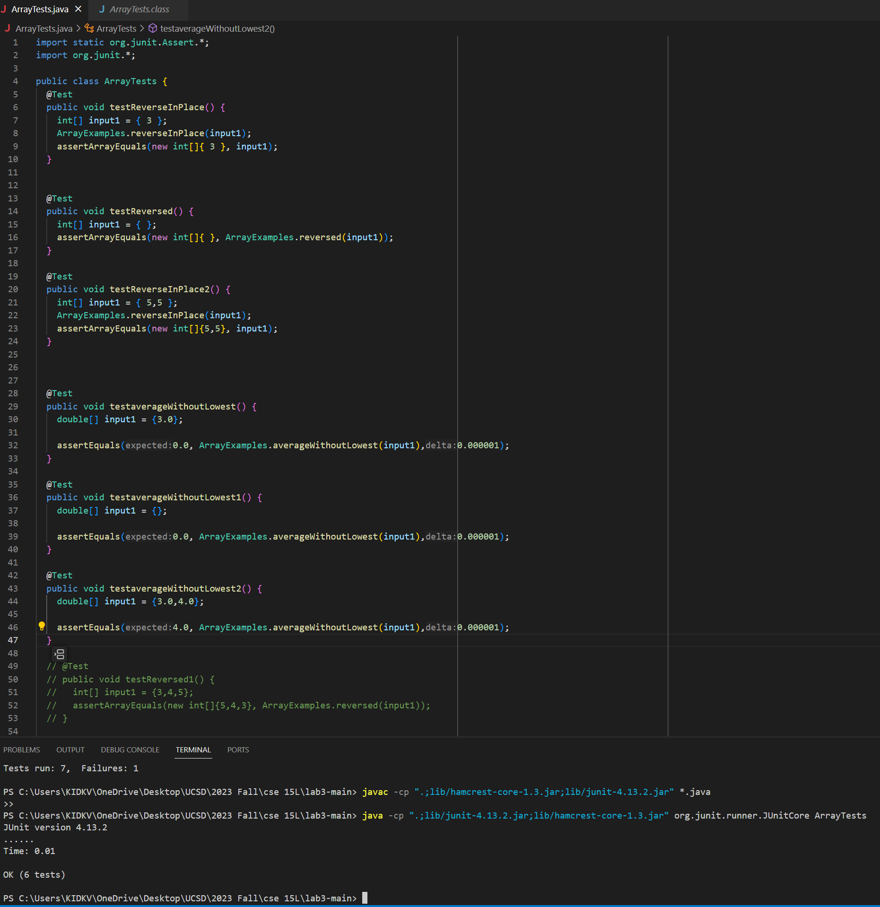
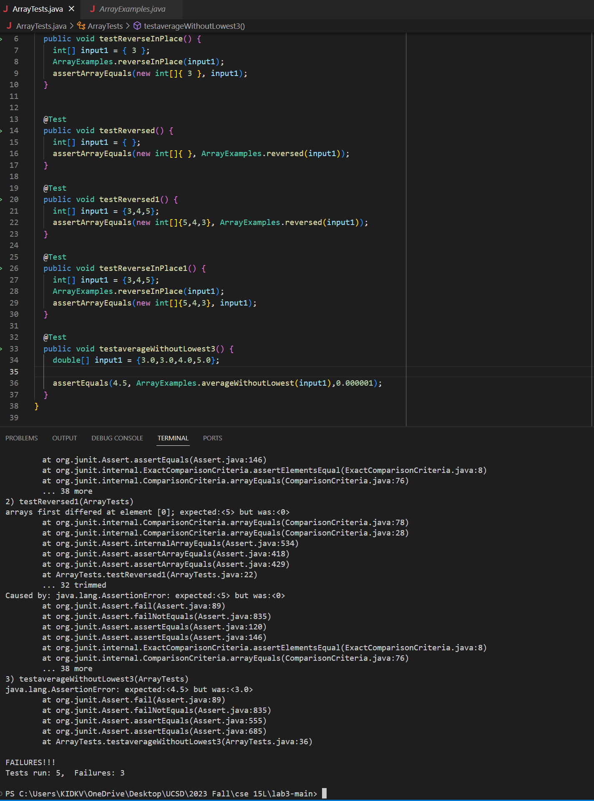

**Part 1**--------------------------------------------------------------------------------------------------------------------------------------------------------


**Code Before**
````md
public class ArrayExamples {

  static void reverseInPlace(int[] arr) {
    for(int i = 0; i < arr.length; i += 1) {
      arr[i] = arr[arr.length - i - 1];
    }
  }

  static int[] reversed(int[] arr) {
    int[] newArray = new int[arr.length];
    for(int i = 0; i < arr.length; i += 1) {
      arr[i] = newArray[arr.length - i - 1];
    }
    return arr;
  }

  static double averageWithoutLowest(double[] arr) {
    if(arr.length < 2) { return 0.0; }
    double lowest = arr[0];
    for(double num: arr) {
      if(num < lowest) { lowest = num; }
    }
    double sum = 0;
    for(double num: arr) {
      if(num != lowest) { sum += num; }
    }
    return sum / (arr.length - 1);
  }
}
````

**Success**
````md
import static org.junit.Assert.*;
import org.junit.*;

public class ArrayTests {
	@Test 
	public void testReverseInPlace() {
    int[] input1 = { 3 };
    ArrayExamples.reverseInPlace(input1);
    assertArrayEquals(new int[]{ 3 }, input1);
	}


  @Test
  public void testReversed() {
    int[] input1 = { };
    assertArrayEquals(new int[]{ }, ArrayExamples.reversed(input1));
  }

  @Test 
	public void testReverseInPlace2() {
    int[] input1 = { 5,5 };
    ArrayExamples.reverseInPlace(input1);
    assertArrayEquals(new int[]{5,5}, input1);
	}


  
  @Test
  public void testaverageWithoutLowest() {
    double[] input1 = {3.0};
    
    assertEquals(0.0, ArrayExamples.averageWithoutLowest(input1),0.000001);
  }

  @Test
  public void testaverageWithoutLowest1() {
    double[] input1 = {};
    
    assertEquals(0.0, ArrayExamples.averageWithoutLowest(input1),0.000001);
  }

  @Test
  public void testaverageWithoutLowest2() {
    double[] input1 = {3.0,4.0};
    
    assertEquals(4.0, ArrayExamples.averageWithoutLowest(input1),0.000001);
  }

PS C:\Users\KIDKV\OneDrive\Desktop\UCSD\2023 Fall\cse 15L\lab3-main> javac -cp ".;lib/hamcrest-core-1.3.jar;lib/junit-4.13.2.jar" *.java
>>
PS C:\Users\KIDKV\OneDrive\Desktop\UCSD\2023 Fall\cse 15L\lab3-main> java -cp ".;lib/junit-4.13.2.jar;lib/hamcrest-core-1.3.jar" org.junit.runner.JUnitCore ArrayTests
JUnit version 4.13.2
......
Time: 0.018

OK (6 tests)
````



**Failure**
````md

  @Test
  public void testReversed1() {
    int[] input1 = {3,4,5};
    assertArrayEquals(new int[]{5,4,3}, ArrayExamples.reversed(input1));
  }

  @Test
  public void testReverseInPlace1() {
    int[] input1 = {3,4,5};
    ArrayExamples.reverseInPlace(input1);
    assertArrayEquals(new int[]{5,4,3}, input1);
  }

  

  @Test
  public void testaverageWithoutLowest3() {
    double[] input1 = {3.0,3.0,4.0,5.0};
    
    assertEquals(4.5, ArrayExamples.averageWithoutLowest(input1),0.000001);
  }

PS C:\Users\KIDKV\OneDrive\Desktop\UCSD\2023 Fall\cse 15L\lab3-main> javac -cp ".;lib/hamcrest-core-1.3.jar;lib/junit-4.13.2.jar" *.java
>>
PS C:\Users\KIDKV\OneDrive\Desktop\UCSD\2023 Fall\cse 15L\lab3-main> java -cp ".;lib/junit-4.13.2.jar;lib/hamcrest-core-1.3.jar" org.junit.runner.JUnitCore ArrayTests
JUnit version 4.13.2
.E.E.E
Time: 0.009
There were 3 failures:
1) testReverseInPlace1(ArrayTests)
arrays first differed at element [2]; expected:<3> but was:<5>
        at org.junit.internal.ComparisonCriteria.arrayEquals(ComparisonCriteria.java:78)
        at org.junit.internal.ComparisonCriteria.arrayEquals(ComparisonCriteria.java:28)
        at org.junit.Assert.internalArrayEquals(Assert.java:534)
        at org.junit.Assert.assertArrayEquals(Assert.java:418)
        at org.junit.Assert.assertArrayEquals(Assert.java:429)
        at ArrayTests.testReverseInPlace1(ArrayTests.java:59)
        ... 32 trimmed
Caused by: java.lang.AssertionError: expected:<3> but was:<5>
        at org.junit.Assert.fail(Assert.java:89)
        at org.junit.Assert.failNotEquals(Assert.java:835)
        at org.junit.Assert.assertEquals(Assert.java:120)
        at org.junit.Assert.assertEquals(Assert.java:146)
        at org.junit.internal.ExactComparisonCriteria.assertElementsEqual(ExactComparisonCriteria.java:8)
        at org.junit.internal.ComparisonCriteria.arrayEquals(ComparisonCriteria.java:76)
        ... 38 more
2) testReversed1(ArrayTests)
arrays first differed at element [0]; expected:<5> but was:<0>
        at org.junit.internal.ComparisonCriteria.arrayEquals(ComparisonCriteria.java:78)
        at org.junit.internal.ComparisonCriteria.arrayEquals(ComparisonCriteria.java:28)
        at org.junit.Assert.internalArrayEquals(Assert.java:534)
        at org.junit.Assert.assertArrayEquals(Assert.java:418)
        at org.junit.Assert.assertArrayEquals(Assert.java:429)
        at ArrayTests.testReversed1(ArrayTests.java:52)
        ... 32 trimmed
Caused by: java.lang.AssertionError: expected:<5> but was:<0>
        at org.junit.Assert.fail(Assert.java:89)
        at org.junit.Assert.failNotEquals(Assert.java:835)
        at org.junit.Assert.assertEquals(Assert.java:120)
        at org.junit.Assert.assertEquals(Assert.java:146)
        at org.junit.internal.ExactComparisonCriteria.assertElementsEqual(ExactComparisonCriteria.java:8)
        at org.junit.internal.ComparisonCriteria.arrayEquals(ComparisonCriteria.java:76)
        ... 38 more
3) testaverageWithoutLowest3(ArrayTests)
java.lang.AssertionError: expected:<4.5> but was:<3.0>
        at org.junit.Assert.fail(Assert.java:89)
        at org.junit.Assert.failNotEquals(Assert.java:835)
        at org.junit.Assert.assertEquals(Assert.java:555)
        at org.junit.Assert.assertEquals(Assert.java:685)
        at ArrayTests.testaverageWithoutLowest3(ArrayTests.java:68)

FAILURES!!!
Tests run: 3,  Failures: 3
````


**After change**
````md
public class ArrayExamples {

  // Changes the input array to be in reversed order
  static void reverseInPlace(int[] arr) {
    int[] newArray = new int[arr.length];
    for(int i = 0; i < arr.length; i += 1) {
      newArray[i] = arr[arr.length - i - 1];
    }
    for(int i = 0;i<newArray.length;i++){
        arr[i] = newArray[i];
    }
    
  }

  // Returns a *new* array with all the elements of the input array in reversed
  // order
  static int[] reversed(int[] arr) {
    int[] newArray = new int[arr.length];
    for(int i = 0; i < arr.length; i += 1) {
      newArray[i] = arr[arr.length - i - 1];
    }
    return newArray;
  }

  // Averages the numbers in the array (takes the mean), but leaves out the
  // lowest number when calculating. Returns 0 if there are no elements or just
  // 1 element in the array
  static double averageWithoutLowest(double[] arr) {
    int count = 0;
    if(arr.length < 2) { return 0.0; }
    double lowest = arr[0];
    for(double num: arr) {
      if(num < lowest) { lowest = num; }
    }
    double sum = 0;
    for(double num: arr) {
      if(num != lowest) { 
        sum += num; 
        count++;
      }
    }
    return sum / (count);
  }


} 

````
**reverseInPlace**: This method changes it's element in the first place to last place, the second to last-1 place. When it get to the second half of the array, it will have the same element as before because the first half has already been changed. One solution is to store the reversed array in another array and let the original array equal to the reversed array.

**reversed**: This method let empty array as every element of the original array therefore, we will return an empty array. One solution is to assign the empty array equal to the original array from the back to get the reversed array.

**averageWithoutLowest**: If there are two lowest number, then the array need to minus 2 at the end. However, it only minus1, which assume there are one lowest number everytime. Therefore, we can count how many lowest number in the for loop and divide sum by that instead of array length-1


**Part 2**--------------------------------------------------------------------------------------------------------------------------------------------------------

**find -P**: it is used as a defult find statement. There is no difference between directly using find and find-p
````md
KIDKV@DESKTOP-I09QJL7 MINGW64 ~/docsearch (main)
$ find -P ./technical -name "pmed.00202*"
./technical/plos/pmed.0020200.txt
./technical/plos/pmed.0020201.txt
./technical/plos/pmed.0020203.txt
./technical/plos/pmed.0020206.txt
./technical/plos/pmed.0020208.txt
./technical/plos/pmed.0020209.txt
./technical/plos/pmed.0020210.txt
./technical/plos/pmed.0020212.txt
./technical/plos/pmed.0020216.txt
./technical/plos/pmed.0020226.txt
./technical/plos/pmed.0020231.txt
./technical/plos/pmed.0020232.txt
./technical/plos/pmed.0020235.txt
./technical/plos/pmed.0020236.txt
./technical/plos/pmed.0020237.txt
./technical/plos/pmed.0020238.txt
./technical/plos/pmed.0020239.txt
./technical/plos/pmed.0020242.txt
./technical/plos/pmed.0020246.txt
./technical/plos/pmed.0020247.txt
./technical/plos/pmed.0020249.txt
./technical/plos/pmed.0020257.txt
./technical/plos/pmed.0020258.txt
./technical/plos/pmed.0020268.txt
./technical/plos/pmed.0020272.txt
./technical/plos/pmed.0020273.txt
./technical/plos/pmed.0020274.txt
./technical/plos/pmed.0020275.txt
./technical/plos/pmed.0020278.txt
./technical/plos/pmed.0020281.txt

KIDKV@DESKTOP-I09QJL7 MINGW64 ~/docsearch (main)
$ find -P ./technical -name "*pa*"
./technical/government/Media/agency_expands.txt
./technical/government/Media/Campaign_Pays.txt
./technical/government/Media/Legal_Aid_campaign.txt
./technical/government/Post_Rate_Comm/Cohenetal_comparison.txt
````

**find -name**: it find the specifc name file in a directory

````md
KIDKV@DESKTOP-I09QJL7 MINGW64 ~/docsearch (main)
$ find ./technical -name "chapter*"
./technical/911report/chapter-1.txt
./technical/911report/chapter-10.txt
./technical/911report/chapter-11.txt
./technical/911report/chapter-12.txt
./technical/911report/chapter-13.1.txt
./technical/911report/chapter-13.2.txt
./technical/911report/chapter-13.3.txt
./technical/911report/chapter-13.4.txt
./technical/911report/chapter-13.5.txt
./technical/911report/chapter-2.txt
./technical/911report/chapter-3.txt
./technical/911report/chapter-5.txt
./technical/911report/chapter-6.txt
./technical/911report/chapter-7.txt
./technical/911report/chapter-8.txt
./technical/911report/chapter-9.txt

KIDKV@DESKTOP-I09QJL7 MINGW64 ~/docsearch (main)
$ find ./technical -name "*ab*"
./technical/government/About_LSC/LegalServCorp_v_VelazquezSyllabus.txt
./technical/government/Media/fight_domestic_abuse.txt
./technical/government/Media/not_accessible_to_disabled.txt
````

**find -type d**: find all the dictionary in the given path and their sub dictionaries
````md
KIDKV@DESKTOP-I09QJL7 MINGW64 ~/docsearch (main)
$ find ./technical -type d
./technical
./technical/911report
./technical/biomed
./technical/government
./technical/government/About_LSC
./technical/government/Alcohol_Problems
./technical/government/Env_Prot_Agen
./technical/government/Gen_Account_Office
./technical/government/Media
./technical/government/Post_Rate_Comm
./technical/plos

KIDKV@DESKTOP-I09QJL7 MINGW64 ~/docsearch (main)
$ find ./technical/biomed -type d
./technical/biomed

KIDKV@DESKTOP-I09QJL7 MINGW64 ~/docsearch (main)
$ find ./technical/government -type d
./technical/government
./technical/government/About_LSC
./technical/government/Alcohol_Problems
./technical/government/Env_Prot_Agen
./technical/government/Gen_Account_Office
./technical/government/Media
./technical/government/Post_Rate_Comm
````

**find -maxdepth** : find things such as file, dictionary, in the maxdepth of N in a dictionary
````md
KIDKV@DESKTOP-I09QJL7 MINGW64 ~/docsearch (main)
$ find ./technical -maxdepth 2 -type d
./technical
./technical/911report
./technical/biomed
./technical/government
./technical/government/About_LSC
./technical/government/Alcohol_Problems
./technical/government/Env_Prot_Agen
./technical/government/Gen_Account_Office
./technical/government/Media
./technical/government/Post_Rate_Comm
./technical/plos

KIDKV@DESKTOP-I09QJL7 MINGW64 ~/docsearch (main)
$ find ./technical -maxdepth 2 -type f -name "*030*"
./technical/biomed/gb-2001-2-8-research0030.txt
./technical/plos/journal.pbio.0020302.txt
./technical/plos/journal.pbio.0020306.txt
./technical/plos/journal.pbio.0020307.txt
./technical/plos/journal.pbio.0030021.txt
./technical/plos/journal.pbio.0030024.txt
./technical/plos/journal.pbio.0030032.txt
./technical/plos/journal.pbio.0030050.txt
./technical/plos/journal.pbio.0030051.txt
./technical/plos/journal.pbio.0030056.txt
./technical/plos/journal.pbio.0030062.txt
./technical/plos/journal.pbio.0030065.txt
./technical/plos/journal.pbio.0030076.txt
./technical/plos/journal.pbio.0030094.txt
./technical/plos/journal.pbio.0030097.txt
./technical/plos/journal.pbio.0030102.txt
./technical/plos/journal.pbio.0030105.txt
./technical/plos/journal.pbio.0030127.txt
./technical/plos/journal.pbio.0030129.txt
./technical/plos/journal.pbio.0030131.txt
./technical/plos/journal.pbio.0030136.txt
./technical/plos/journal.pbio.0030137.txt
./technical/plos/pmed.0010030.txt
````

