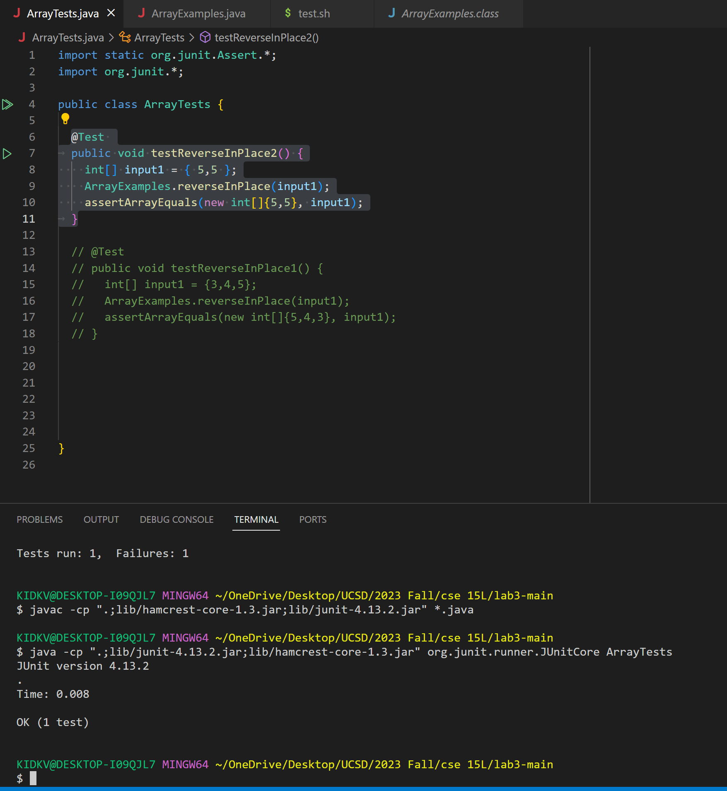
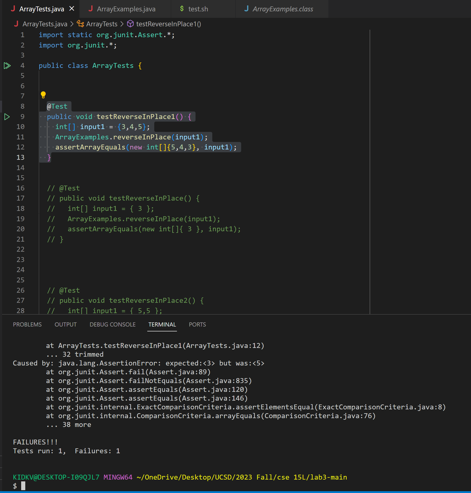
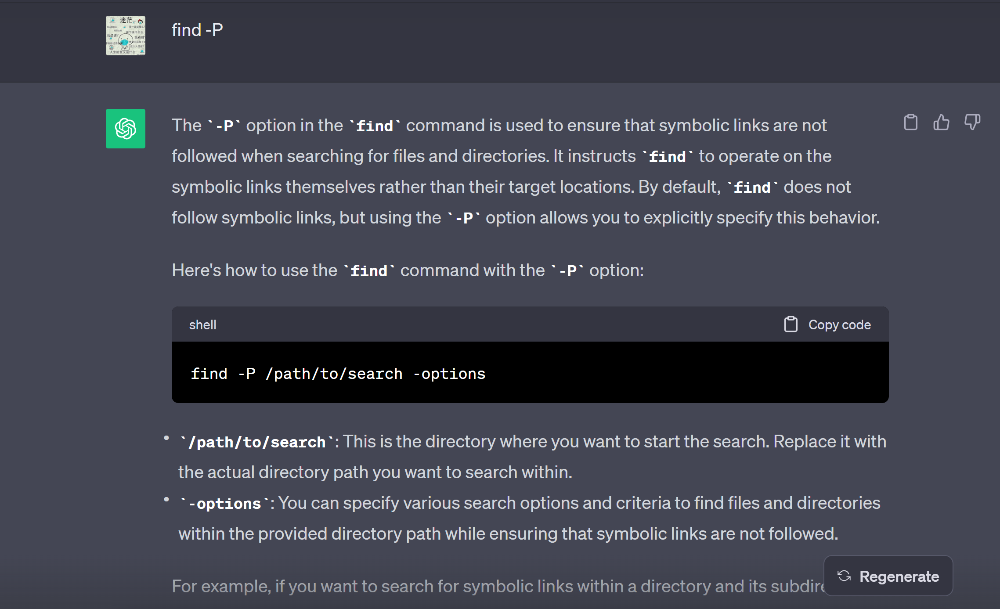
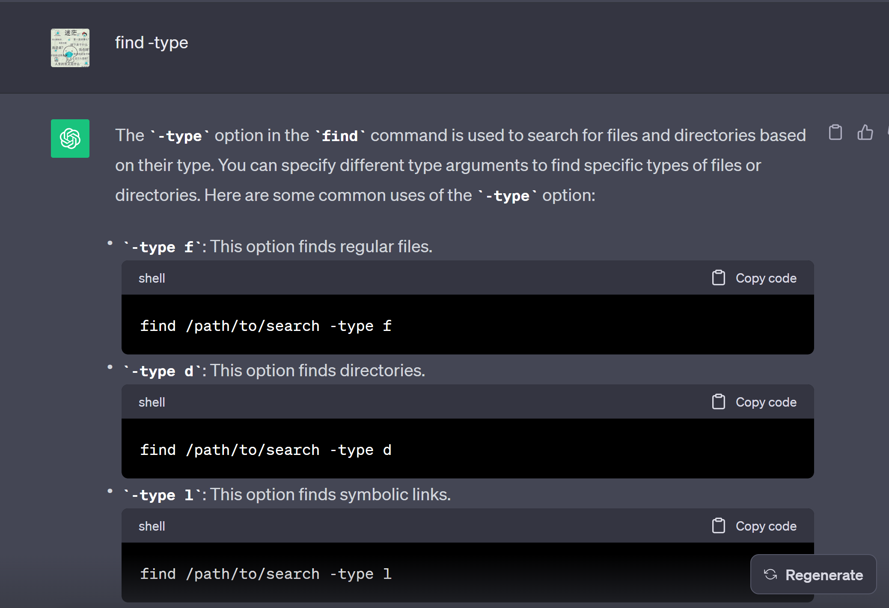

# Part 1


**Code Before**
````md
public class ArrayExamples {

  static void reverseInPlace(int[] arr) {
    for(int i = 0; i < arr.length; i += 1) {
      arr[i] = arr[arr.length - i - 1];
    }
  }
}
````

**Success**
````md
@Test 
	public void testReverseInPlace2() {
    int[] input1 = { 5,5 };
    ArrayExamples.reverseInPlace(input1);
    assertArrayEquals(new int[]{5,5}, input1);
	}

KIDKV@DESKTOP-I09QJL7 MINGW64 ~/OneDrive/Desktop/UCSD/2023 Fall/cse 15L/lab3-main
$ javac -cp ".;lib/hamcrest-core-1.3.jar;lib/junit-4.13.2.jar" *.java

KIDKV@DESKTOP-I09QJL7 MINGW64 ~/OneDrive/Desktop/UCSD/2023 Fall/cse 15L/lab3-main
$ java -cp ".;lib/junit-4.13.2.jar;lib/hamcrest-core-1.3.jar" org.junit.runner.JUnitCore ArrayTests
JUnit version 4.13.2
.
Time: 0.008

OK (1 test)
````



**Failure**
````md
@Test
  public void testReverseInPlace1() {
    int[] input1 = {3,4,5};
    ArrayExamples.reverseInPlace(input1);
    assertArrayEquals(new int[]{5,4,3}, input1);
  }

KIDKV@DESKTOP-I09QJL7 MINGW64 ~/OneDrive/Desktop/UCSD/2023 Fall/cse 15L/lab3-main
$ javac -cp ".;lib/hamcrest-core-1.3.jar;lib/junit-4.13.2.jar" *.java

KIDKV@DESKTOP-I09QJL7 MINGW64 ~/OneDrive/Desktop/UCSD/2023 Fall/cse 15L/lab3-main
$ java -cp ".;lib/junit-4.13.2.jar;lib/hamcrest-core-1.3.jar" org.junit.runner.JUnitCore ArrayTests
JUnit version 4.13.2
.E
Time: 0.013
There was 1 failure:
1) testReverseInPlace1(ArrayTests)
arrays first differed at element [2]; expected:<3> but was:<5>
        at org.junit.internal.ComparisonCriteria.arrayEquals(ComparisonCriteria.java:78)
        at org.junit.internal.ComparisonCriteria.arrayEquals(ComparisonCriteria.java:28)
        at org.junit.Assert.internalArrayEquals(Assert.java:534)
        at org.junit.Assert.assertArrayEquals(Assert.java:418)
        at org.junit.Assert.assertArrayEquals(Assert.java:429)
        at ArrayTests.testReverseInPlace1(ArrayTests.java:12)
        ... 32 trimmed
Caused by: java.lang.AssertionError: expected:<3> but was:<5>
        at org.junit.Assert.fail(Assert.java:89)
        at org.junit.Assert.failNotEquals(Assert.java:835)
        at org.junit.Assert.assertEquals(Assert.java:120)
        at org.junit.Assert.assertEquals(Assert.java:146)
        at org.junit.internal.ExactComparisonCriteria.assertElementsEqual(ExactComparisonCriteria.java:8)
        at org.junit.internal.ComparisonCriteria.arrayEquals(ComparisonCriteria.java:76)
        ... 38 more

FAILURES!!!
Tests run: 1,  Failures: 1
````


**After change**
````md
public class ArrayExamples {

  // Changes the input array to be in reversed order
  static void reverseInPlace(int[] arr) {
    int[] newArray = new int[arr.length];
    for(int i = 0; i < arr.length; i += 1) {
      newArray[i] = arr[arr.length - i - 1];
    }
    for(int i = 0;i<newArray.length;i++){
        arr[i] = newArray[i];
    }
  }
} 

````
**reverseInPlace**: This method changes its element in the first place to last place, the second to last-1 place, and so on. Before the change, the method changes its element on itself, making the first half of the array become the inverse of the second half. However, if we want to change the second half of the array and make it the inverse of the first half, we are considering the first half of the array. The first half of the array is already equal to the inverse  When it gets to the second half of the array, it will have the same element as before because the first half has already been changed. One solution is storing the reversed array in another array and letting the original array equal the reversed one. In the code after change, I create another "newArray" and store the inverse Arrayinsde, then I do another for loop to make every element of the original array "arr" equal to the "newArray". This will not make the inverse to repeat itself because I stored all of the inverse "arr" into the "newArray"


# Part 2


````md
find -P: There is no difference between directly using `find` and `find -P` if we do not include the symbolic link. If there is a symbolic link referring to a file or dictionary, the find -P will not get into that symbolic link while `find` will. This can be useful if we do not want to include any symbolic link in our search.

//find the file in "technical" include "pemed.00202" 
KIDKV@DESKTOP-I09QJL7 MINGW64 ~/docsearch (main)
$ find -P ./technical -name "pmed.00202*"
./technical/plos/pmed.0020200.txt
./technical/plos/pmed.0020201.txt
./technical/plos/pmed.0020203.txt
./technical/plos/pmed.0020206.txt
./technical/plos/pmed.0020208.txt
./technical/plos/pmed.0020209.txt
./technical/plos/pmed.0020210.txt
./technical/plos/pmed.0020212.txt
./technical/plos/pmed.0020216.txt
./technical/plos/pmed.0020226.txt
./technical/plos/pmed.0020231.txt
./technical/plos/pmed.0020232.txt
./technical/plos/pmed.0020235.txt
./technical/plos/pmed.0020236.txt
./technical/plos/pmed.0020237.txt
./technical/plos/pmed.0020238.txt
./technical/plos/pmed.0020239.txt
./technical/plos/pmed.0020242.txt
./technical/plos/pmed.0020246.txt
./technical/plos/pmed.0020247.txt
./technical/plos/pmed.0020249.txt
./technical/plos/pmed.0020257.txt
./technical/plos/pmed.0020258.txt
./technical/plos/pmed.0020268.txt
./technical/plos/pmed.0020272.txt
./technical/plos/pmed.0020273.txt
./technical/plos/pmed.0020274.txt
./technical/plos/pmed.0020275.txt
./technical/plos/pmed.0020278.txt
./technical/plos/pmed.0020281.txt


//find the file in "technical" include "pa"
KIDKV@DESKTOP-I09QJL7 MINGW64 ~/docsearch (main)
$ find -P ./technical -name "*pa*"
./technical/government/Media/agency_expands.txt
./technical/government/Media/Campaign_Pays.txt
./technical/government/Media/Legal_Aid_campaign.txt
./technical/government/Post_Rate_Comm/Cohenetal_comparison.txt
````



````md
find -name: it find the specifc name file in a directory. This can be very useful if we want to find files that contain one specific name in tons of files in a dictionary.

//find the file in "technical" include "chapter"
KIDKV@DESKTOP-I09QJL7 MINGW64 ~/docsearch (main)
$ find ./technical -name "chapter*"
./technical/911report/chapter-1.txt
./technical/911report/chapter-10.txt
./technical/911report/chapter-11.txt
./technical/911report/chapter-12.txt
./technical/911report/chapter-13.1.txt
./technical/911report/chapter-13.2.txt
./technical/911report/chapter-13.3.txt
./technical/911report/chapter-13.4.txt
./technical/911report/chapter-13.5.txt
./technical/911report/chapter-2.txt
./technical/911report/chapter-3.txt
./technical/911report/chapter-5.txt
./technical/911report/chapter-6.txt
./technical/911report/chapter-7.txt
./technical/911report/chapter-8.txt
./technical/911report/chapter-9.txt


// find files in "technical" include "ab"
KIDKV@DESKTOP-I09QJL7 MINGW64 ~/docsearch (main)
$ find ./technical -name "*ab*"
./technical/government/About_LSC/LegalServCorp_v_VelazquezSyllabus.txt
./technical/government/Media/fight_domestic_abuse.txt
./technical/government/Media/not_accessible_to_disabled.txt
````


````md
find -type d: find all the dictionary in the given path and their sub-dictionaries. If there are many paths in a dictionary and you want to know the dictionaries you want to find are in which path, then this method will be very useful

//find all of the dictionary in "technical"
KIDKV@DESKTOP-I09QJL7 MINGW64 ~/docsearch (main)
$ find ./technical -type d
./technical
./technical/911report
./technical/biomed
./technical/government
./technical/government/About_LSC
./technical/government/Alcohol_Problems
./technical/government/Env_Prot_Agen
./technical/government/Gen_Account_Office
./technical/government/Media
./technical/government/Post_Rate_Comm
./technical/plos


//find all of the dictionaries in "biomed" in "technical"
KIDKV@DESKTOP-I09QJL7 MINGW64 ~/docsearch (main)
$ find ./technical/biomed -type d
./technical/biomed


//find all of the dictionaries in "government" in "technical"
KIDKV@DESKTOP-I09QJL7 MINGW64 ~/docsearch (main)
$ find ./technical/government -type d
./technical/government
./technical/government/About_LSC
./technical/government/Alcohol_Problems
./technical/government/Env_Prot_Agen
./technical/government/Gen_Account_Office
./technical/government/Media
./technical/government/Post_Rate_Comm
````



````md
find -maxdepth : find things such as a file, and dictionary, in the max depth of N in a dictionary. This is particularly useful when there are so many files or dictionary and we only want to find dictionary or files in the depth of N


// find all of the dictionaries that search in to maximum of depth 2 in "technical"
KIDKV@DESKTOP-I09QJL7 MINGW64 ~/docsearch (main)
$ find ./technical -maxdepth 2 -type d
./technical
./technical/911report
./technical/biomed
./technical/government
./technical/government/About_LSC
./technical/government/Alcohol_Problems
./technical/government/Env_Prot_Agen
./technical/government/Gen_Account_Office
./technical/government/Media
./technical/government/Post_Rate_Comm
./technical/plos


// find all of the files that search into a maximum of depth 2 in "technical" include the name "030"
KIDKV@DESKTOP-I09QJL7 MINGW64 ~/docsearch (main)
$ find ./technical -maxdepth 2 -type f -name "*030*"
./technical/biomed/gb-2001-2-8-research0030.txt
./technical/plos/journal.pbio.0020302.txt
./technical/plos/journal.pbio.0020306.txt
./technical/plos/journal.pbio.0020307.txt
./technical/plos/journal.pbio.0030021.txt
./technical/plos/journal.pbio.0030024.txt
./technical/plos/journal.pbio.0030032.txt
./technical/plos/journal.pbio.0030050.txt
./technical/plos/journal.pbio.0030051.txt
./technical/plos/journal.pbio.0030056.txt
./technical/plos/journal.pbio.0030062.txt
./technical/plos/journal.pbio.0030065.txt
./technical/plos/journal.pbio.0030076.txt
./technical/plos/journal.pbio.0030094.txt
./technical/plos/journal.pbio.0030097.txt
./technical/plos/journal.pbio.0030102.txt
./technical/plos/journal.pbio.0030105.txt
./technical/plos/journal.pbio.0030127.txt
./technical/plos/journal.pbio.0030129.txt
./technical/plos/journal.pbio.0030131.txt
./technical/plos/journal.pbio.0030136.txt
./technical/plos/journal.pbio.0030137.txt
./technical/plos/pmed.0010030.txt
````

